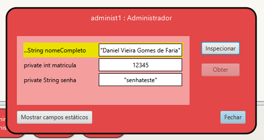
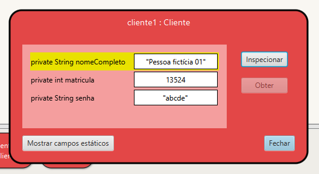
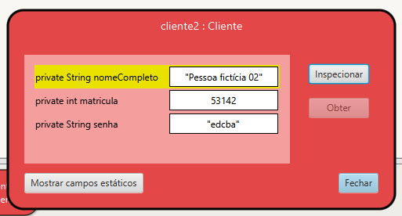
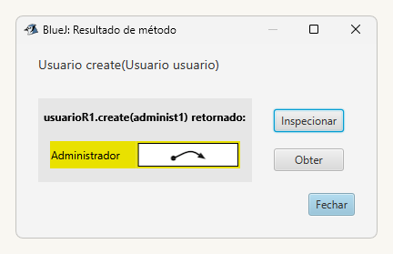
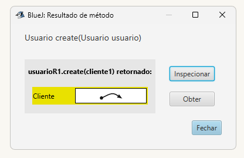
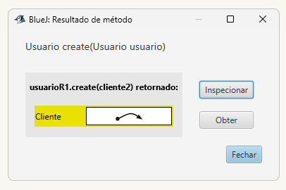
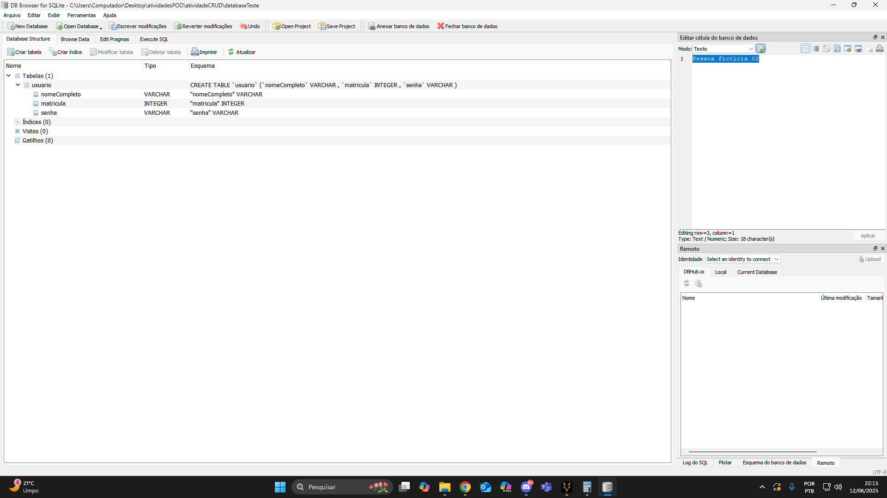
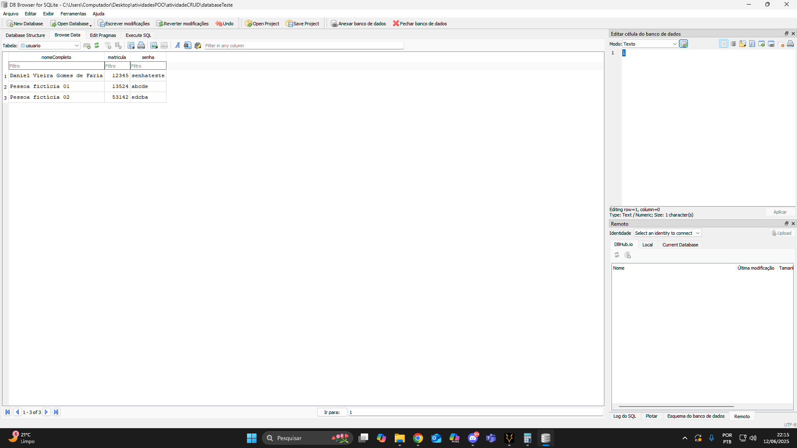

# Atividade - [LAB] AT-06-10: Implementar ORM de uma classe Modelo do Projeto

## Com base na classe Usuario, implementei o ORM relativo às subclasses Administrador e Cliente que modelam o cadastro de dois usuários distintos que utilizariam nosso projeto.

### Inicialmente, instanciei três usuários distintos, um Administrador e dois Cliente fictícios. 

### Em seguida, usando o método 'create()' adicionei os três usuários ao banco de dados criado para a atividade.

### Por fim, usando o DB Browser, abri o arquivo databaseTeste para verificar se a tabela de dados e os usuários haviam realmente sido adicionados.

